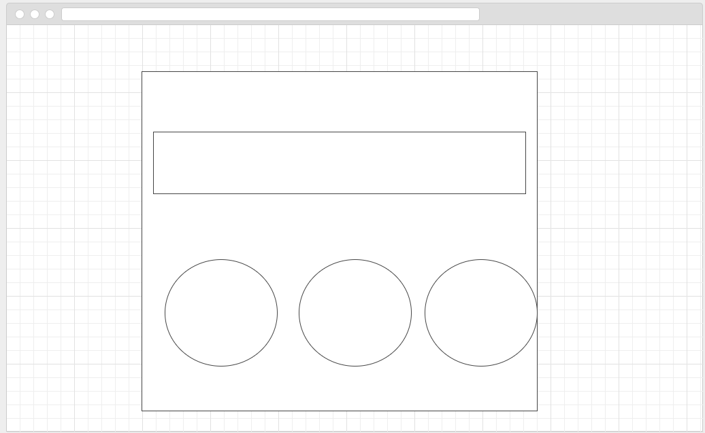

# Project-3

##About this App

This is a weather app that was build using the React MERN Stack. 

A user is able to create an account, and then see the local forecast for their favorite city.

A stretch goal is to be able to incorporate use of an API to pull in current weather data from any city in the world. 

Link to Wireframe: https://wireframe.cc/186g6d

Link to Trello: https://trello.com/b/pE4ipiCz/your-weather-app

Link to Heroku: https://springer937-project-3.herokuapp.com/

Link to ERD: https://www.lucidchart.com/documents/edit/4b4d0130-342e-4669-b019-f9a3b5a2290e/0
